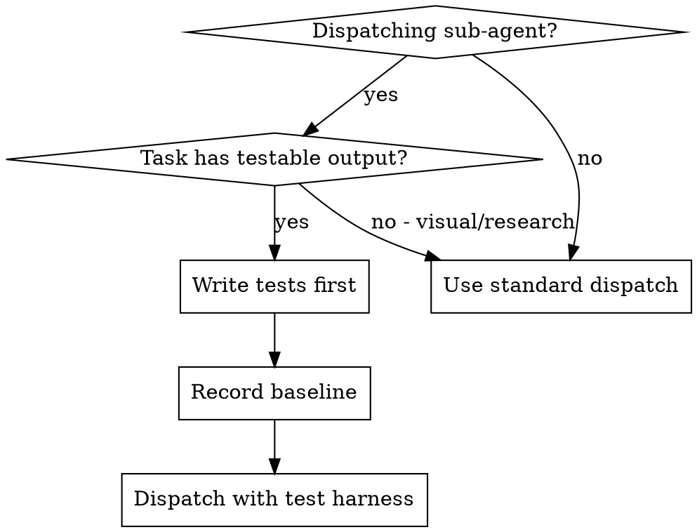

# TDD-Gated Sub-Agent Dispatch

## Overview

Write failing tests. Dispatch the sub-agent. Validate mechanically.

## When to Use



**Use when:**
- Dispatching a sub-agent to implement a handler, service, component, or API endpoint
- Dispatching a sub-agent to refactor code that has existing tests
- Any task where the expected behavior can be asserted mechanically
- Any task where the primary agent wants a mechanical validation gate on sub-agent output

**Don't use when:**
- Task is visual/layout work with no mechanical assertion
- Task is exploratory research or investigation
- Task is a doc edit, config change, or file move (use simpler dispatch)
- The interface itself is the design decision the sub-agent must make

## The Pattern

### Phase 1: Primary Agent Writes the Test Harness

Before dispatching, the primary agent does three things:

**1. Write failing tests that define the contract.**

Map the task type to the right test layer:

| Task type | Test layer | Example |
|---|---|---|
| New handler/service | Unit test | Import expected exports, call with expected args, assert return values |
| New API endpoint | Integration test | Supertest hits expected routes, asserts status codes and response shapes |
| New UI component | Component test | RTL renders component, asserts expected DOM and interactions |
| New user flow | E2E test | Playwright navigates the flow, asserts page state |
| Refactor | Existing suite | Record current pass count as the regression baseline |

**2. Commit the tests to the branch.**

**3. Run the tests and record the baseline.**

```bash
# New tests should FAIL (they define unimplemented behavior)
pnpm test -- newFeature.test.ts
# Expected: 0 passing, N failing

# Existing suite should PASS (this is the regression baseline)
pnpm test
# Expected: 396 passing, 0 failing
```

Record both numbers. They go into the dispatch prompt.

### Phase 2: Dispatch with the Harness

The dispatch prompt includes five elements:

1. **Task description** (what to build)
2. **Test file paths** (what must pass)
3. **Baseline numbers** (what must not regress)
4. **Definition of done** (mechanical, not subjective)
5. **Worktree and branch setup** (per R-702)

### Phase 3: Validate on Return

When the sub-agent returns:

```bash
# 1. New tests pass
pnpm test -- newFeature.test.ts
# Expected: N passing, 0 failing

# 2. No regressions
pnpm test
# Expected: >= 396 passing

# 3. Build clean
pnpm build
```

If any check fails, the work is incomplete. Do not merge.

## Dispatch Prompt Template

```markdown
## Task
[One paragraph describing what to build]

## Worktree
cd /absolute/path/to/worktree
Branch: feature/xyz

## Pre-written tests (MUST pass when you are done)
- src/__tests__/handlers/newFeature.test.ts (currently FAILING, N test cases)
- src/__tests__/services/newService.test.ts (currently FAILING, M test cases)

Read these test files first. They define the contract.

## Existing suite baseline
- Server: 396 tests passing
- Web: 259 tests passing
Your work must not reduce these numbers.

## Definition of done
1. All new tests green: `pnpm test -- newFeature newService`
2. No regressions: `pnpm test` shows >= 396 server, >= 259 web
3. Build clean: `pnpm build`
4. Commit test + implementation together

## What NOT to do
- Do not modify the pre-written test files (they are the contract)
- Do not delete or skip existing tests
- Do not stub implementations that make tests pass without real logic
- Do not change function signatures that existing code depends on
```

## What the Primary Agent Writes (by task type)

### Handler/Service task

```typescript
// src/__tests__/handlers/createWidget.test.ts
import { describe, expect, it, vi } from 'vitest';
import { createWidgetHandler } from '../../handlers/widgets/createWidget';

describe('createWidgetHandler', () => {
    it('returns 201 with the created widget', async () => {
        const req = { body: { name: 'Test Widget', type: 'standard' } };
        const res = { status: vi.fn().mockReturnThis(), json: vi.fn() };

        await createWidgetHandler(req as any, res as any);

        expect(res.status).toHaveBeenCalledWith(201);
        expect(res.json).toHaveBeenCalledWith(
            expect.objectContaining({ name: 'Test Widget' })
        );
    });

    it('returns 400 when name is missing', async () => {
        const req = { body: { type: 'standard' } };
        const res = { status: vi.fn().mockReturnThis(), json: vi.fn() };

        await createWidgetHandler(req as any, res as any);

        expect(res.status).toHaveBeenCalledWith(400);
    });
});
```

### API endpoint task

```typescript
// src/__tests__/integration/widgets-api.test.ts
import { describe, expect, it } from 'vitest';
import supertest from 'supertest';
import { app } from '../../app';

describe('POST /api/widgets', () => {
    it('creates a widget and returns 201', async () => {
        const res = await supertest(app)
            .post('/api/widgets')
            .set('X-Requested-With', 'XMLHttpRequest')
            .send({ name: 'Test', type: 'standard' });

        expect(res.status).toBe(201);
        expect(res.body).toHaveProperty('id');
    });
});
```

### Component task

```typescript
// src/__tests__/components/WidgetCard.test.tsx
import { describe, expect, it } from 'vitest';
import { render, screen } from '@testing-library/react';
import { WidgetCard } from '../../components/WidgetCard/WidgetCard';

describe('WidgetCard', () => {
    it('renders widget name and type', () => {
        render(<WidgetCard name="Test Widget" type="standard" />);

        expect(screen.getByText('Test Widget')).toBeInTheDocument();
        expect(screen.getByText('standard')).toBeInTheDocument();
    });
});
```

### Refactor task (baseline-only)

No new tests needed. The dispatch prompt specifies:

```markdown
## Existing suite baseline
Server: 396 tests passing. Your refactor must not reduce this number.

## Definition of done
1. `pnpm test` shows >= 396 passing
2. Build clean
3. No new lint errors
```

## Handling Test Modifications

**Rule: Sub-agents must not modify pre-written test files.**

If a sub-agent needs to change a test to make it pass, it must report back with the discrepancy. The primary agent decides whether to update the contract.

**Exception:** Adding `import` statements to test files when the sub-agent creates a new module that the test needs to reference is allowed, but only when the test file already has a placeholder comment like `// import will be added by implementer`.

## Common Mistakes

| Mistake | Fix |
|---|---|
| Writing tests that pass without implementation (tautological) | Assert against real return values and side effects. Verify that replacing the implementation with `throw new Error('not implemented')` causes the test to fail. |
| Forgetting to record the baseline | Run and record the full suite count before dispatch. |
| Letting the sub-agent modify test files | Reject and re-dispatch. |
| Writing tests that are too specific about implementation | Test behavior (return values, side effects), not internal structure. |
| Skipping the harness for "simple" tasks | Apply the harness regardless of task size. |
| Not committing tests before dispatch | Commit before dispatch. |

## When TDD-Gated Dispatch is Not Possible

For tasks where the output cannot be mechanically asserted (visual work, research, exploration), fall back to:

1. **Existing suite baseline check:** "These N tests pass now; they must still pass after your change."
2. **Diff review on return:** Compare the sub-agent's output against the original file. Flag any deletions of non-trivial code.
3. **Scope constraint:** "You may only modify files X, Y, Z. Changes to other files will be rejected."


## Verification Checklist

Before dispatching:
- [ ] Failing tests written and committed
- [ ] Tests run and confirmed failing (not erroring)
- [ ] Existing suite baseline recorded
- [ ] Dispatch prompt includes test paths, baseline, and definition of done
- [ ] Dispatch prompt includes "do not modify test files"

After sub-agent returns:
- [ ] New tests pass
- [ ] Existing suite count equals or exceeds baseline
- [ ] Build clean
- [ ] No test files were modified by the sub-agent
- [ ] Diff review: no unexpected deletions
